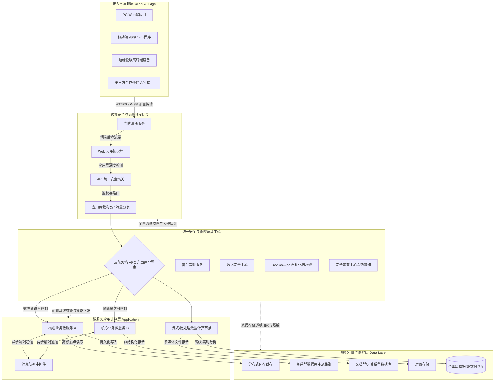

# 企业信息化平台标准技术架构规划（安全导向版）

## 1. 架构演进背景与核心原则

在全球数字化转型与网络威胁日益严峻的背景下，现代企业信息化平台应彻底摒弃紧耦合的传统单体架构，全面转向**高度解耦、弹性伸缩的云原生分层架构**。架构的核心不仅在于支撑海量高并发业务，更在于从底层遵循**“安全左移”**、**“纵深防御”**与**“零信任架构”**的原则。

本架构不再局限于特定的编程语言或技术栈（如 Java/Spring Boot、Node.js），而是提供一个通用的、具备绝对合规性（符合等保2.0等相关法规）的全栈IT演进蓝图。

## 2. 总体技术分层架构规划

通过将业务逻辑、数据存储、技术组件与安全管控机制进行物理与逻辑的双重解耦，架构整体被划分为四大层次，并贯穿统一的安全运营中心（SOC）。

### 2.1 逻辑架构图 (Logical Architecture Diagram)
该拓扑图清晰展示了各层级组件的协同关系、流量控制路径与底层数据流向：

## 3. 分层组件职责说明

### 3.1 接入与展现层 (Client & Edge Layer)
* 涵盖所有的终端设备（浏览器、移动端App、物联网边缘设备）及与第三方系统的接口。
* 重点：所有出入流量必须强制使用 **HTTPS/TLS 1.2+ 加密通信**。

### 3.2 边界安全与流量分发 (Edge Security & Gateway Layer)
* 外部不可信流量在进入企业核心计算环境前的必经之路。
* **高防清洗**拦截大流量泛洪 DDoS 攻击。
* **WAF** 进行七层应用深度检测，过滤 SQL注入、跨站脚本（XSS）、恶意爬虫。
* **API网关** 负责统一的鉴权（OAuth2/JWT）、路由、限流、并记录所有调用审计日志。

### 3.3 微服务应用计算层 (Application Layer)
* 执行核心业务逻辑。采用微服务架构提升系统横向扩展能力。
* 服务之间采用**消息队列**（如 Kafka, RabbitMQ）进行异步解耦通信。
* 内部所有跨 VPC 或微服务的通信均受到云防火墙的**微隔离（Micro-segmentation）管控**，防止内部横向移动威胁。

### 3.4 数据存储与处理层 (Data Layer)
* 实施严格的读写分离策略，并使用分布式缓存（Redis/Memcached）进行热点查询加速。
* 引入**密钥管理服务（KMS）**对所有结构化（关系型数据库）与非结构化（OSS/MongoDB）核心数据执行落盘级透明加密。

### 3.5 统一安全与管控中心 (Security Operations)
* 这是一个逻辑上完全独立的网络区域，负责统筹全网的安全策略下发、入侵审计、DevSecOps 流程以及态势感知。

## 4. 架构高可用 (HA) 部署原则
为保证业务连续性，系统不依赖单一技术栈的特性，而是通过基础设施的跨域部署来实现高可用：

* **边界组件**：采用跨可用区双机主备（Active-Passive）或 SaaS 化自动弹性伸缩。
* **计算层**：无状态服务通过容器编排平台（如 Kubernetes）进行管理，Pod 副本利用**反亲和性（Anti-Affinity）**强制打散到不同的物理故障域。
* **数据层**：核心关系型数据库必须采用主从（Primary/Standby）跨可用区架构，实现故障时的自动无损同步接管。
* **安全管控**：部署在独立的“安全管理 VPC”内，利用**带外管理（Out-of-band management）**通道，在业务网络拥塞或被攻击时仍能对全网设备进行干预。