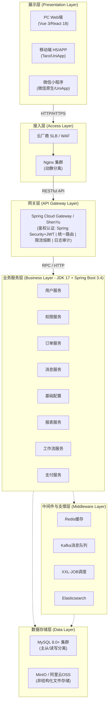
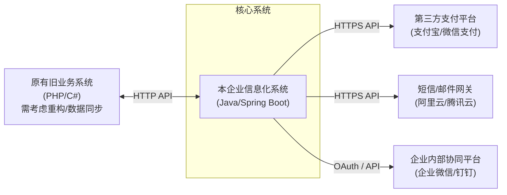
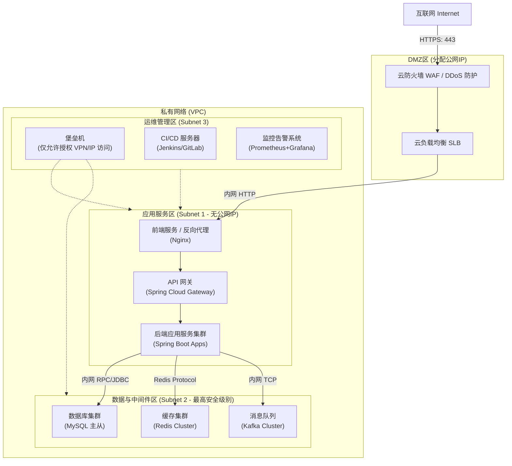

# 企业信息化平台技术架构文档

## 1. 概述
本文档旨在为企业信息化平台提供基于业界最佳实践的标准技术架构。本平台基于 **JDK 17**、**Spring Boot 3.4** 等前沿技术栈构建，旨在提供高可用、可扩展、安全可靠的企业级服务。

## 2. 核心技术栈选型

### 2.1 后端技术栈
* **编程语言**：Java 17 (利用新特性如Record, 增强的Switch, ZGC等，提升性能和开发效率)
* **核心框架**：Spring Boot 3.4 (原生支持Jakarta EE 10, AOT编译和虚拟线程支持)
* **微服务治理/服务间通信**：Spring Cloud (如需微服务拆分) / RESTful API / gRPC
* **ORM框架**：MyBatis-Plus 或 Spring Data JPA
* **权限认证**：Spring Security + OAuth2.0 / JWT
* **API 文档**：Springdoc OpenAPI (Swagger 3)

### 2.2 数据存储与中间件
* **关系型数据库**：MySQL 8.0+ (提供更好的JSON支持，窗口函数，性能提升)
* **分布式缓存**：Redis (用于热点数据缓存、分布式锁、会话共享)
* **消息队列**：Apache Kafka (处理高吞吐量异步消息、削峰填谷、日志收集)
* **搜索引擎 (可选)**：Elasticsearch (用于复杂全文检索、日志聚合分析)
* **对象存储**：MinIO / 阿里云OSS / 腾讯云COS (非结构化数据如图片、文档存储)

### 2.3 前端技术栈 (建议)
* **核心框架**：Vue 3 或 React 18
* **UI 组件库**：Element Plus (Vue) / Ant Design (React)
* **状态管理**：Pinia (Vue) / Redux Toolkit (React)
* **构建工具**：Vite

### 2.4 运维与部署技术栈
* **容器化**：Docker
* **容器编排**：Kubernetes (K8s) (推荐用于生产环境的高可用和弹性伸缩)
* **CI/CD**：GitLab CI / Jenkins / GitHub Actions
* **网关与反向代理**：Nginx / Spring Cloud Gateway
* **监控与告警**：Prometheus + Grafana
* **链路追踪**：SkyWalking / Jaeger
* **集中式日志**：ELK Stack (Elasticsearch, Logstash/Filebeat, Kibana) / EFK

## 3. 系统架构设计

### 3.1 逻辑架构图 (Logical Architecture Diagram)
这是架构选型最核心的一张图。它从逻辑上将系统分层，帮助技术团队明确各个层次的技术选型和职责。

### 3.2 系统上下文图 (System Context Diagram)
系统上下文图帮助评估接口对接的复杂度，明确本系统与外部系统的交互边界。

## 4. 网络拓扑规划 (Network Topology)

为了兼顾安全与性能，网络层面通常采用**VPC (Virtual Private Cloud)** 进行逻辑隔离。

### 4.1 网络分区设计
* **公网接入区 (DMZ)**:
  * 包含云防火墙 (WAF)、公共负载均衡器 (SLB/ALB)。
  * 仅开放 80 (HTTP) 和 443 (HTTPS) 端口。
* **应用/服务区 (内网)**:
  * 部署 Nginx、API Gateway、各个 Spring Boot 后端服务节点、前端静态资源服务器。
  * 仅允许来自 DMZ 区的特定流量访问。不对外网直接暴露。
* **数据与中间件区 (核心内网)**:
  * 部署 MySQL、Redis、Kafka 等。
  * 这是最核心的安全防线，仅允许应用服务区的主机在特定端口进行访问。
  * 数据库禁止分配公网 IP。
* **运维管理区**:
  * 部署堡垒机/跳板机、GitLab、CI/CD 服务器、Prometheus、日志收集等。
  * 运维人员通过 VPN 接入内网，再经过堡垒机访问其他各区服务器进行运维操作。

### 4.2 拓扑图示意 (Network Topology Diagram)

