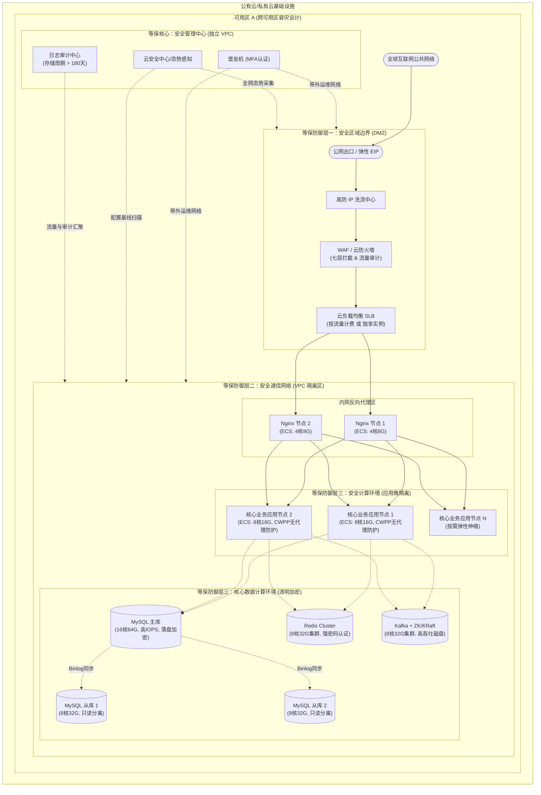

# 企业信息化平台部署参考文档（等保 2.0 合规版）

## 1. 概述
本文档描述了企业信息化平台的基础设施部署架构方案。为满足《网络安全等级保护基本要求2.0》（等保2.0）的强合规监管，本部署方案严格贯彻“一个中心，三重防御”的纵深防御体系。文档提供了一套通用、不局限于特定编程语言的技术组件部署基准、环境划分规范，以及合规的持续集成与持续交付（CI/CD）流程设计。

## 2. 部署环境规划与安全隔离

为保证系统稳定性与开发效率，并满足等保关于“测试数据与生产数据严格隔离”的要求，平台划分为四个主要的部署环境，环境之间必须实现网络级物理或严格的逻辑隔离（VPC 对等连接管控）：

### 2.1 开发环境 (DEV)
* **用途**: 开发人员日常代码编写、联调、初步自测。
* **特点**: 频繁更新，可用性要求不高。**严禁导入未经脱敏的生产数据**。
* **访问控制**: 仅限于开发团队内部访问（强制通过公司 VPN 接入）。

### 2.2 测试环境 (TEST/QA)
* **用途**: 质量保证团队（QA）进行集成测试、系统测试、性能压测及自动化回归测试。
* **特点**: 环境稳定性高于 DEV，配置架构贴近生产。**数据必须使用专门的模糊测试伪造数据**。
* **访问控制**: 开发、测试人员通过堡垒机访问，不向最终用户开放。

### 2.3 预发布环境 (PRE/UAT)
* **用途**: 用户验收测试（User Acceptance Testing），生产发布前的最后一环。
* **特点**: 架构、配置与生产环境保持完全一致。使用生产级别的负载均衡和安全策略。
* **访问控制**: 少数内部用户、产品经理进行业务走查，**严格执行数据防泄露与审计**，不对公众开放。

### 2.4 生产环境 (PROD)
* **用途**: 正式对外提供服务，承载企业核心商业机密。
* **特点**: 极高的可用性、稳定性、安全性要求。所有变更必须经过严格的线上工单审批。
* **等保合规要求**: 具备完整的态势感知、入侵防御、防病毒、落盘加密与 180 天以上的全量日志审计闭环。运维人员必须通过双因素认证（MFA）与堡垒机接入。

## 3. 服务器资源分配与等保物理部署架构

依据等保 2.0 对“安全区域边界”、“安全通信网络”、“安全计算环境”的纵深要求，以下为 PROD 环境的部署架构。

### 3.1 物理部署架构图 (Deployment Architecture Diagram)
物理部署架构图展示了软件组件如何映射到实际的云资源上，并严格标注了等保合规的安全域划分，用于直接输出云资源的采购清单（BOM表）。

以下是一个中等规模企业级应用的基础资源分配方案，可根据实际 QPS、并发量和数据量进行横向扩展（Scale-out）或纵向扩展（Scale-up）。

**核心原则**: 数据库服务器重 CPU/内存/IOPS；应用服务器重 CPU/内存；缓存服务器重内存；消息队列重 IOPS/内存。

### 3.1 负载均衡与边界安全区
* **角色**: 高防IP / WAF / Nginx / HAProxy / 云原生负载均衡器 (SLB)
* **等保要求**: 必须具备抗 D/CC 攻击能力，开启 HTTPS 强加密传输，阻断恶意探测扫描。
* **规格建议**: 4核 CPU / 8GB 内存 / 50GB 高性能系统盘 / 高带宽网络出口 (如 50-100Mbps)
* **数量**: 至少 2 台 (主备/双活架构)

### 3.2 核心应用计算区
* **角色**: 后端微服务与业务应用计算节点 (语言无关，如 Java/Node.js/Go)
* **等保要求**: 工作负载部署端点防护平台（CWPP/云安全中心），执行严格的 OS 漏洞扫描与基线核查。
* **规格建议**: 8核 CPU / 16GB 或 32GB 内存 / 100GB 系统盘
* **数量**: 至少 3-4 台 (视微服务拆分和预估并发量而定，支持弹性扩缩容)
* **配置提示**: 无论采用何种运行时环境（JVM、V8 引擎或 Go Runtime），资源配比应严格控制在计算密集型/内存均衡型（vCPU:RAM ≈ 1:2 或 1:4），并根据运行时的垃圾回收（GC）机制预留充足的系统开销。

### 3.3 核心数据存储区
* **角色**: MySQL 8.0+ (一主多从)
* **等保要求**: 数据必须支持跨节点备份，开启 KMS 落盘透明加密，数据库运维全量计入审计日志。严禁直接绑定公网 IP。
* **规格建议 (主库)**: 16核 CPU / 64GB 内存 / 500GB+ SSD 极速云盘 (关注高 IOPS)
* **规格建议 (从库)**: 8核 CPU / 32GB 内存 / 500GB+ SSD (承载只读流量)
* **数量**: 至少 1 主 2 从

### 3.4 分布式缓存区
* **角色**: Redis Cluster
* **等保要求**: 禁止绑定外网，配置复杂的访问鉴权凭证，开启日志并定期修改密码。
* **规格建议**: 8核 CPU / 32GB 内存 / 100GB 系统盘
* **数量**: 至少 3 主 3 从 (部署在至少 3 台物理节点上)

### 3.5 消息队列中间件区
* **角色**: Apache Kafka + Zookeeper / KRaft
* **规格建议**: 8核 CPU / 32GB 内存 / 100GB系统盘 + 500GB 数据盘 (高 IO 吞吐)
* **数量**: 至少 3 台构建高可用集群

### 3.6 安全管理中心 (带外运维区)
* **角色**: 堡垒机, SOC态势感知, 日志审计系统(ELK)
* **等保要求**: 这是等保2.0的“一中心”核心，所有日常管理动作与业务流量物理/逻辑分离。
* **规格建议**:
  * 堡垒机 (MFA必须): 2核 / 4GB
  * ELK (日志保留期>180天): 至少 3 台 (16核 / 32GB / T级别大容量低频存储盘)

## 4. CI/CD (持续集成与安全交付 / DevSecOps)

为从源头上阻断安全隐患，部署流程必须由传统的 CI/CD 升级为融入“安全左移”理念的 DevSecOps 流水线。

### 4.1 DevSecOps 总体流程
代码提交 (云效代码管理) -> 触发构建 (云效流水线) -> **核心卡点: 静态代码扫描 (SAST) + 敏感凭证防泄漏 (AK/SK) (云效代码检测)** -> 单元测试 -> 构建 Docker 镜像 -> **核心卡点: 容器镜像 CVE 漏洞扫描** -> 推送镜像仓库 (制品仓库Packages) -> 严格工单审批触发部署 -> Kubernetes/Swarm 拉取镜像更新服务 -> 自动化验证与态势监控。

### 4.2 应用容器化构建与部署安全优化
无论底层业务应用采用何种技术栈，均强烈要求全面采用容器化部署（Docker/Kubernetes）以实现计算资源的标准化与弹性隔离。

1. **多阶段构建 (Multi-stage Build) 与镜像极简原则**:
   在 `Dockerfile` 中，必须将带有编译工具链（如 JDK/Maven, Node+NPM, Go compiler）的构建阶段（Builder Stage）与最终的运行阶段（Runtime Stage）彻底分离。生产运行镜像必须采用 Alpine Linux 或 Google Distroless 等极简操作系统基础镜像。此举不仅能将镜像体积缩小高达 90%，更能从根本上消除非必要的 OS 包管理器与 Shell 环境，极大收敛底层已知 CVE 漏洞基数。
2. **最小权限原则与非 Root 运行 (Non-Root User)**:
   在容器运行态，严格禁止应用进程使用默认的 `root` 用户运行。`Dockerfile` 必须显式声明并切换至低权限的业务用户（如 `USER appuser`）。结合 Kubernetes 的 Security Context，强制禁止容器提权（`allowPrivilegeEscalation: false`）并配置只读根文件系统（`readOnlyRootFilesystem: true`），防止被入侵后植入后门木马。
3. **依赖分离与构建缓存层优化**:
   在构建流程中，应优先拷贝依赖描述文件（如 `pom.xml`, `package.json`, `go.mod`）并执行依赖库下载安装；随后再拷贝频繁变动的业务源代码层。这种依赖分离技术能最大程度命中 Docker 构建引擎的缓存（Layer Cache），显著提升 CI/CD 流水线的重复构建速度。

### 4.3 自动化运维与部署工具链
本平台依托阿里云云效作为官方 DevSecOps 工具链：
* **代码托管**:  [云效代码管理](https://codeup.aliyun.com/?navKey=mine) (开启离职人员自动撤权与防泄漏审计)
* **构建与发布**:  [云效流水线](https://flow.aliyun.com/my?page=1)
* **代码审查与质量安全门禁**:  [云效代码检测](https://codeup.aliyun.com/checks/tasks)
* **容器镜像仓库**:  [制品仓库Packages](https://packages.aliyun.com/) (强制开启镜像推送后自动查杀扫描)

### 4.4 滚动更新与灰度发布机制
* 平台必须支持**零宕机无损部署**。在 Kubernetes 中通过配置 `Deployment` 的 `strategy.type: RollingUpdate` 来实现滚动更新。
* 核心变更需采用**细粒度金丝雀灰度发布**，通过 Ingress 或 Gateway 网关路由规则，将极少部分真实流量（如 5%）导入新版本服务，在 APM 监控未发现 5xx 错误或 CPU 异动后再全量发布。一旦识别到性能劣化或安全告警，支持一键秒级回滚。