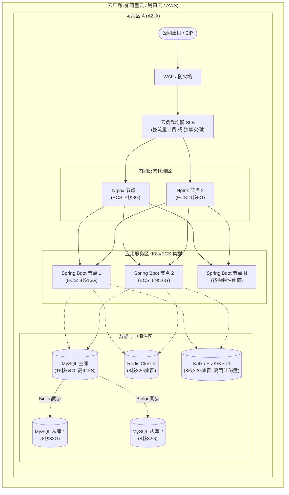

# 企业信息化平台部署文档

## 1. 概述
本文档详细描述了基于 JDK 17 和 Spring Boot 3.4 构建的企业信息化平台的部署架构，包含服务器资源分配建议、环境划分以及持续集成与持续交付（CI/CD）流程设计。

## 2. 部署环境规划

为保证系统稳定性与开发效率，平台通常划分为四个主要的部署环境：

### 2.1 开发环境 (DEV)
* **用途**: 开发人员日常代码编写、联调、初步自测。
* **特点**: 频繁更新，可用性要求不高，资源分配相对较少。数据库数据可能包含测试脏数据。
* **访问**: 仅限于开发团队内部访问（例如通过公司 VPN）。

### 2.2 测试环境 (TEST/QA)
* **用途**: 质量保证团队（QA）进行集成测试、系统测试、性能压测及自动化回归测试。
* **特点**: 环境稳定性高于 DEV，配置应尽可能贴近生产环境架构。包含相对干净的测试数据。
* **访问**: 开发、测试人员访问，不向最终用户开放。

### 2.3 预发布环境 (PRE/UAT)
* **用途**: 用户验收测试（User Acceptance Testing），生产发布前的最后一环。
* **特点**: 架构、配置、甚至脱敏后的数据都应与生产环境保持一致（或尽可能相近）。使用生产级别的负载均衡和安全策略。
* **访问**: 少数内部用户、产品经理进行业务走查，不对公众开放。

### 2.4 生产环境 (PROD)
* **用途**: 正式对外提供服务。
* **特点**: 极高的可用性、稳定性、安全性要求。所有变更必须经过严格审批。资源配置最高。
* **访问**: 终端用户访问。运维人员严格控制访问权限。

## 3. 服务器资源分配建议 (以 PROD 为例)

### 3.1 物理部署架构图 (Deployment Architecture Diagram)
物理部署架构图展示了软件组件如何映射到实际的服务器资源上，用于直接输出服务器和云资源的采购清单（BOM表）。

以下是一个中等规模企业级应用的基础资源分配方案，可根据实际 QPS、并发量和数据量进行横向扩展（Scale-out）或纵向扩展（Scale-up）。

**核心原则**: 数据库服务器重 CPU/内存/IOPS；应用服务器重 CPU/内存；缓存服务器重内存；消息队列重 IOPS/内存。

### 3.1 负载均衡与网关区
* **角色**: Nginx / HAProxy / 云原生负载均衡器 (SLB)
* **规格建议**: 4核 CPU / 8GB 内存 / 50GB 高性能系统盘 / 高带宽网络出口 (如 50-100Mbps)
* **数量**: 至少 2 台 (主备/双活架构)

### 3.2 应用服务区
* **角色**: Spring Boot 3.4 后端应用 (利用 JDK 17 优化)
* **规格建议**: 8核 CPU / 16GB 或 32GB 内存 / 100GB 系统盘
* **数量**: 至少 3-4 台 (视微服务拆分和预估并发量而定，支持弹性扩缩容)
* **配置提示**: JVM 参数根据 JDK 17 的特性调整 (如 `-XX:+UseZGC` 或 G1，`-Xms8g -Xmx8g`)。

### 3.3 数据库区
* **角色**: MySQL 8.0+ (一主多从)
* **规格建议 (主库)**: 16核 CPU / 64GB 内存 / 500GB+ SSD 极速云盘 (关注高 IOPS)
* **规格建议 (从库)**: 8核 CPU / 32GB 内存 / 500GB+ SSD (承载只读流量)
* **数量**: 至少 1 主 2 从

### 3.4 缓存中间件区
* **角色**: Redis Cluster
* **规格建议**: 8核 CPU / 32GB 内存 / 100GB 系统盘
* **数量**: 至少 3 主 3 从 (部署在至少 3 台物理节点上)
* **注意**: 若使用云数据库 Redis 版，可直接购买对应规格的集群实例。

### 3.5 消息队列中间件区
* **角色**: Apache Kafka + Zookeeper / KRaft
* **规格建议**: 8核 CPU / 32GB 内存 / 100GB系统盘 + 500GB 数据盘 (高 IO 吞吐)
* **数量**: 至少 3 台构建高可用集群

### 3.6 运维与基础组件区
* **角色**: 堡垒机, CI/CD, 日志系统(ELK), 监控报警(Prometheus)
* **规格建议**:
  * 堡垒机: 2核 / 4GB
  * Jenkins/GitLab: 8核 / 16GB
  * ELK: 至少 3 台 (16核 / 32GB / 大容量磁盘)

## 4. CI/CD (持续集成与部署)

### 4.1 总体流程
代码提交 (Git) -> 触发构建 (Jenkins/GitLab CI) -> 静态代码扫描 (SonarQube) -> 单元测试 -> 构建 Docker 镜像 -> 推送镜像仓库 (Harbor) -> 自动/手动触发部署 -> Kubernetes/Swarm 拉取镜像更新服务 -> 自动化验证。

### 4.2 Spring Boot 3.4 与 JDK 17 的部署优化
由于使用了 Spring Boot 3.x，强烈建议采用容器化部署（Docker/Kubernetes）。

1. **多阶段构建 (Multi-stage Build)**:
   在 `Dockerfile` 中使用一个包含 JDK/Maven(或Gradle) 的基础镜像进行编译打包，再将产出的 JAR 拷贝到一个仅包含 JRE 17 (如 Alpine 瘦身版) 的运行环境镜像中，大幅减小最终镜像体积。
2. **Spring Boot Native Image (可选)**:
   Spring Boot 3.x 深度整合了 GraalVM，可通过 AOT 编译生成 Native Image（原生二进制可执行文件）。
   * 优势：启动时间极快（毫秒级），内存占用极低。适合弹性伸缩、Serverless 场景。
   * 劣势：编译时间长，部分动态特性（如复杂的反射、CGLib代理）可能需要额外配置。
   * 建议：评估是否需要极致的冷启动速度，若应用长期运行且重视吞吐量，传统的 JIT 编译（标准 JVM 运行模式）依然是不错的选择。
3. **分层 JAR (Layered Jar)**:
   利用 Spring Boot 的 Layered Jar 特性，在构建 Docker 镜像时将依赖库（dependencies）和业务代码（application）分层打包。由于依赖库变动频率低，可充分利用 Docker 缓存，加快持续集成的构建速度。

### 4.3 自动化运维与部署工具链
* **代码托管**: GitLab 企业版 / Gitea
* **构建与发布**: Jenkins 管道 (Pipeline) / GitLab CI YAML
* **代码审查与质量**: SonarQube 集成
* **容器镜像仓库**: Harbor (私有化部署)
* **容器编排**: Kubernetes (配合 Helm Charts 统一管理应用配置)
* **配置中心**: Spring Cloud Config / Nacos / Apollo (环境配置解耦)

### 4.4 滚动更新与灰度发布
* 平台必须支持**零宕机部署**。在 Kubernetes 中通过配置 `Deployment` 的 `strategy.type: RollingUpdate` 来实现滚动更新。
* 核心变更需采用**灰度发布**（或金丝雀发布），通过 Ingress 或 Gateway 网关路由规则，将少部分真实流量（如 5%）导入新版本服务，观察监控指标正常后再全量发布。
