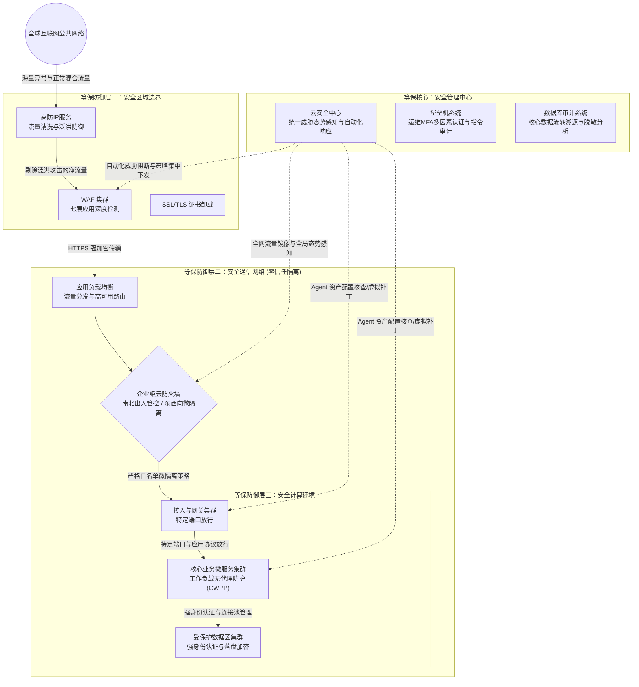
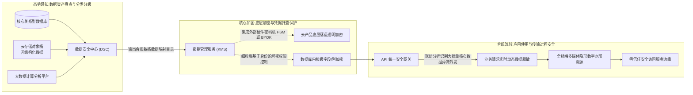
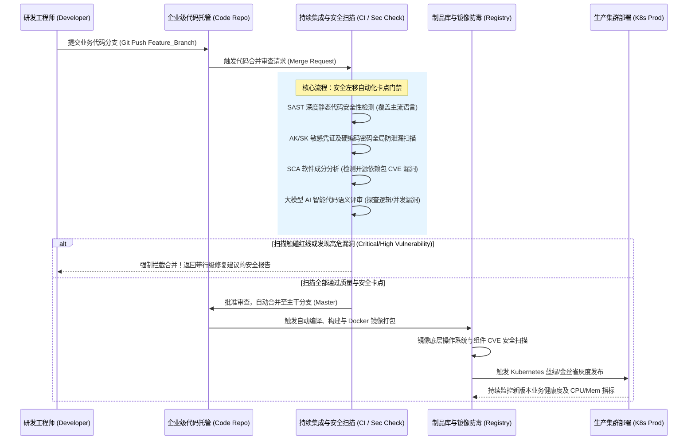

# 企业信息化平台纵深安全防御与 DevSecOps 治理规范

## 1. 基础设施纵深防御体系 (等保 2.0 标准)

依托《网络安全等级保护基本要求2.0》，本架构贯彻**“一个中心，三重防御”**的战略思想，彻底告别单点边界防护的局限性。所有计算资源、数据流转、运维权限均受到等保合规管控。

### 1.1 纵深防御网络拓扑图 (Defense-in-Depth Topology)

### 1.2 三重防线解析
* **第一重：安全区域边界（抵御外部）**：高防清洗抵御泛洪攻击；WAF 利用双引擎（海量日志深度学习 + 主动防御）和 Anti-Bot 拦截漏洞攻击、机器扫描。
* **第二重：安全通信网络（零信任隔离）**：利用新一代云原生防火墙（Cloud Firewall），深入 VPC 内部实现**东西向横向移动管控（Micro-segmentation）**。引入“虚拟补丁（Virtual Patching）”技术在网络层拦截 0-day 利用。
* **第三重：安全计算环境（端点与工作负载）**：通过云安全中心（CWPP/XDR）轻量级 Agent 保护虚拟机、容器与 Serverless。核心是对抗勒索软件的“三重防护”闭环（特征拦截、诱饵监测、极速快照恢复）。

---

## 2. 数据安全全生命周期治理体系

面对《数据安全法》与《个人信息保护法》的强合规要求，数据安全的重心从边界转向“资产可视”与“流转可控”。

### 2.1 全场景数据防护架构流程图 (Data Lifecycle Security)

### 2.2 核心治理模块
* **资产可视 (Data Security Center - DSC)**：自动化全量数据扫描，依托 NLP 和特征模型，输出企业“数据资产分布拓扑图”与敏感数据目录。
* **存储加固 (Data at Rest)**：
  * **落盘透明加密**：通过 KMS 对 ECS、RDS、OSS 一键式加密。
  * **列级加密 (Column-level Encryption)**：基于身份正交权限控制（如 DBA 仅能查询不可读密文，APP 账号可解密），杜绝删库或数据大批量窃取。
* **流转可控 (Data in Transit & Usage)**：
  * **API 异常监控**：深度旁路解析跨会话业务流量，一旦 Response 返回过度敏感信息，立刻熔断 API。
  * **零信任接入 (SASE)**：全面废除“默认信任”，所有远程办公请求需动态身份核验与终端健康检查。
  * **数字水印与防泄露 (DLP)**：应用隐形数字水印，监控并追溯屏幕截取、外传分享事件。

---

## 3. DevSecOps 安全左移与自动化变更闭环

针对 70% 的重大生产事故源于应用变更的历史教训，必须将安全能力无缝内嵌至软件交付全生命周期。

### 3.1 自动化流水线生命周期图 (DevSecOps Pipeline)

### 3.2 交付卡点控制
* **资产极度保护**：企业代码库开启跨可用区三副本灾备，结合大语言模型 (AI) 助手实现毫秒级深层并发、逻辑漏洞评审。
* **CI 安全门禁**：强制 SAST/SCA 检测，扫描出明文硬编码或开源包 CVE 漏洞超出阈值时，自动熔断流水线编译。
* **CD 无损发布**：依托 APM 指标监控，任何引发 5xx 错误或延迟激增的 Kubernetes 灰度发布，一键秒级回滚。

---

## 4. 安全管理制度与应急演练保障体系

技术的长治久安离不开严苛的内部管理体系（内控制度）：

* **动态身份管理与访问控制**：强制推行最小权限原则与 **MFA 多因素认证**。严禁共享高权限账号。人员离职当天（或几小时内）吊销所有生产与 VPN 访问权限。
* **红线合规审计**：严禁明文敏感数据外发，跨部门联调必须使用模糊处理的“伪造测试数据”。
* **日志留存合规**：满足公安部监管要求，核心日志接入集中审计平台，强制保存 **至少180天**，用于渗透回溯与司法取证。
* **变更管控与红蓝对抗**：所有非紧急生产变更必须在线上提交流程，在低峰期（凌晨）指定窗口维护。每季度定期开展实战化内部红蓝对抗演练与全员反钓鱼测试。