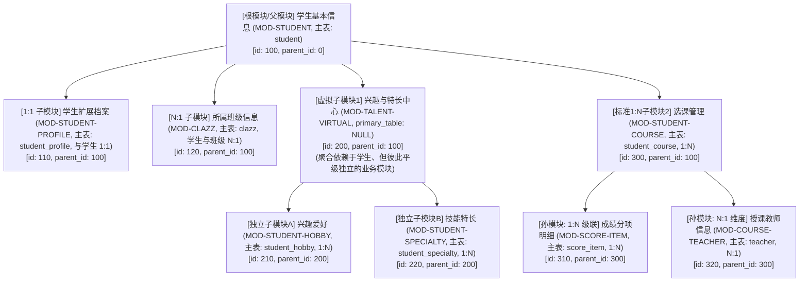

# 基于元数据驱动的模块化模型与执行引擎设计

## 一、 核心目标与愿景

本项目旨在打造一个基于元数据驱动的模块化 SQL 虚拟执行引擎。 传统的 SQL 直接面向高度散落的“物理数据表”，而在企业级与低代码场景下，上层业务、报表中心、表单视图都是以**“业务模块（Module）”**为聚合粒度进行交互的。

### 核心目标：

通过定制的 Module SQL DSL，统一完成面向“业务模块”的声明式数据查询（DQL）与变更（DML），彻底屏蔽底层复杂的跨表 JOIN、1:N 级联批量加载、虚拟层级穿透与拓扑更新细节。

### 1. 目标 DQL（模块化查询）能力

* **模块即实体 (Module as Table/Relation)**：用户在 FROM 中指定根模块标识（如 `FROM \`100\`` 或 `FROM \`MOD-STUDENT\``），引擎自动解析该模块树及其下属的子模块、孙模块及维度表。
* **透明的层级穿透**：通过字段 ID 或层级限定名，引擎自动推导关联路径。对 1:1/N:1 自动走平铺 JOIN，对 1:N 走批量加载（Batch Loading）并自动重组成层次化的层级 JSON / 树状结果集，避免笛卡尔积发散。
* **虚拟模块解耦**：无物理表的虚拟模块仅作业务分类聚合，跨虚拟模块的查询自动向上穿透到父物理主表完成关联解析。

### 2. 目标 DML（模块化级联变更）能力

* **单入口原子级联写入/更新**：通过定制的 DML 语法或结构化 Payload，向一个根模块提交整棵树的变更操作。
* **拓扑排序与外键回填**：引擎基于元数据关系网，自动分析实体依赖拓扑，按“根主表 -> 1:1 从表 -> 1:N 子表 -> 1:N 孙表”自顶向下执行插入，并将主键自增 ID 自动回填到下级外键中；删除时自底向上逆序级联，保证事务一致性。

## 二、 模块拓扑与模型设计

把 1:1（一对一） 和 N:1（多对一） 模块合理地融入这套体系中，不仅能满足多样化测试需求，也完美契合学校教务系统的现实业务逻辑：

* **1:1 模块（一对一平铺/独立从表）**：
  * 学生核心档案 (`student_profile`)：一个学生对应一份档案（身份证号、籍贯、紧急联系电话）。
  * 挂载在学生根模块下作为独立的 1:1 子模块，或者平铺在学生基本信息中。
* **N:1 模块（多对一维度/字典字典表）**：
  * 班级信息 (`clazz`)：多个学生归属于同一个班级。
  * 授课教师 (`teacher`)：选课表里的每门课程关联一名任课教师。
  * 这种维度表在查询引擎中通常作为 Left Join 平铺补充信息，极大丰富了多表关联与维度筛选场景。
* **虚拟模块（容器分组）**：
  * 兴趣与特长中心（无物理主表，虚拟模块）：下面挂载两个平级独立、直接依赖学生的 1:N 模块（爱好 `student_hobby` 与 特长 `student_specialty`）。
* **1:N 父子孙级联链路**：
  * 学生 `student` (父) -> 选课 `student_course` (子) -> 成绩分项 `student_course_score_item` (孙)。

### 模型全景架构树



## 三、 完整的 SQL 模型脚本（H2 方言）

包含：

* 物理表 DDL（覆盖已有表及新增的 `student_hobby`、`student_specialty`）
* 配置数据 DML（`sys_module`、`sys_module_field`、`sys_table_relation`）

```sql
-- =================================================================================
-- 一、 物理业务表结构 (业务库 DDL，支持 H2)
-- =================================================================================

-- 1. 班级表 (维度表，N:1)
CREATE TABLE clazz (
    id BIGINT PRIMARY KEY,
    clazz_name VARCHAR(64) NOT NULL,
    grade VARCHAR(32) NOT NULL
);

-- 2. 学生根表 (只保留最基本的字段)
CREATE TABLE student (
    id BIGINT PRIMARY KEY,
    student_no VARCHAR(32) NOT NULL,
    name VARCHAR(32) NOT NULL,
    clazz_id BIGINT NOT NULL,
    status VARCHAR(32) NOT NULL
);

-- 3. 学生核心档案表 (1:1 依附学生)
CREATE TABLE student_profile (
    id BIGINT PRIMARY KEY,
    student_id BIGINT NOT NULL,
    id_card VARCHAR(32) NOT NULL,
    emergency_phone VARCHAR(32),
    native_place VARCHAR(64)
);

-- 4. 兴趣爱好表 (1:N 依附学生，挂在虚拟模块下)
CREATE TABLE student_hobby (
    id BIGINT PRIMARY KEY,
    student_id BIGINT NOT NULL,
    hobby_name VARCHAR(64) NOT NULL,
    category VARCHAR(32),
    frequency VARCHAR(32)
);

-- 5. 技能特长表 (1:N 依附学生，挂在虚拟模块下)
CREATE TABLE student_specialty (
    id BIGINT PRIMARY KEY,
    student_id BIGINT NOT NULL,
    specialty_name VARCHAR(64) NOT NULL,
    skill_level VARCHAR(32),
    cert_no VARCHAR(64)
);

-- 6. 选课记录表 (1:N 依附学生)
CREATE TABLE student_course (
    id BIGINT PRIMARY KEY,
    student_id BIGINT NOT NULL,
    course_name VARCHAR(64) NOT NULL,
    semester VARCHAR(32) NOT NULL,
    teacher_id BIGINT,
    score DECIMAL(5,2)
);

-- 7. 成绩分项明细表 (1:N 依附选课，构成父子孙链条)
CREATE TABLE student_course_score_item (
    id BIGINT PRIMARY KEY,
    student_course_id BIGINT NOT NULL,
    item_name VARCHAR(100) NOT NULL,
    weight DECIMAL(5,2) NOT NULL,
    score DECIMAL(5,2) NOT NULL,
    remark VARCHAR(255)
);

-- 8. 教师表 (N:1 维度表，依附于选课/课程)
CREATE TABLE teacher (
    id BIGINT PRIMARY KEY,
    teacher_name VARCHAR(32) NOT NULL,
    title VARCHAR(32) NOT NULL
);


-- =================================================================================
-- 二、 模块元数据配置 (sys_module)
-- =================================================================================
INSERT INTO sys_module (id, module_code, module_name, primary_table, parent_id) VALUES
    -- [根模块] 学生（保留基本字段）
    (100, 'MOD-STUDENT', '学生基本信息', 'student', 0),

    -- [1:1 子模块] 学生档案
    (110, 'MOD-STUDENT-PROFILE', '学生扩展档案', 'student_profile', 100),

    -- [N:1 关联模块] 班级维度
    (120, 'MOD-CLAZZ', '所属班级', 'clazz', 100),

    -- [虚拟子模块] 兴趣与特长中心（容器节点，无物理表）
    (200, 'MOD-TALENT-VIRTUAL', '兴趣与特长中心', NULL, 100),
    -- [虚拟节点下的独立子模块A] 爱好
    (210, 'MOD-STUDENT-HOBBY', '兴趣爱好', 'student_hobby', 200),
    -- [虚拟节点下的独立子模块B] 特长
    (220, 'MOD-STUDENT-SPECIALTY', '技能特长', 'student_specialty', 200),

    -- [1:N 子模块] 选课
    (300, 'MOD-STUDENT-COURSE', '选课记录', 'student_course', 100),
    -- [孙模块 - 1:N 级联细项] 选课成绩考核细项
    (310, 'MOD-SCORE-ITEM', '考核分项明细', 'student_course_score_item', 300),
    -- [孙模块 - N:1 维度表] 课程任课教师
    (320, 'MOD-COURSE-TEACHER', '任课教师', 'teacher', 300);


-- =================================================================================
-- 三、 字段元数据配置 (sys_module_field)
-- =================================================================================
-- 1. 根模块字段（学生基本信息）
INSERT INTO sys_module_field (id, module_id, table_name, column_name, display_name, sort_order) VALUES
    (1001, 100, 'student', 'id', '学生ID', 1),
    (1002, 100, 'student', 'student_no', '学号', 2),
    (1003, 100, 'student', 'name', '姓名', 3),
    (1004, 100, 'student', 'status', '学籍状态', 4);

-- 2. 1:1 档案字段
INSERT INTO sys_module_field (id, module_id, table_name, column_name, display_name, sort_order) VALUES
    (1101, 110, 'student_profile', 'id', '档案ID', 1),
    (1102, 110, 'student_profile', 'student_id', '学生ID', 2),
    (1103, 110, 'student_profile', 'id_card', '身份证号', 3),
    (1104, 110, 'student_profile', 'emergency_phone', '紧急联系电话', 4),
    (1105, 110, 'student_profile', 'native_place', '籍贯', 5);

-- 3. N:1 班级维度字段
INSERT INTO sys_module_field (id, module_id, table_name, column_name, display_name, sort_order) VALUES
    (1201, 120, 'clazz', 'id', '班级ID', 1),
    (1202, 120, 'clazz', 'clazz_name', '班级名称', 2),
    (1203, 120, 'clazz', 'grade', '所属年级', 3);

-- (虚拟模块 200 为容器，不映射字段)

-- 4. 虚拟模块下属：爱好字段 (1:N)
INSERT INTO sys_module_field (id, module_id, table_name, column_name, display_name, sort_order) VALUES
    (2101, 210, 'student_hobby', 'id', '记录ID', 1),
    (2102, 210, 'student_hobby', 'student_id', '学生ID', 2),
    (2103, 210, 'student_hobby', 'hobby_name', '爱好名称', 3),
    (2104, 210, 'student_hobby', 'category', '兴趣类别', 4),
    (2105, 210, 'student_hobby', 'frequency', '参与频次', 5);

-- 5. 虚拟模块下属：特长字段 (1:N)
INSERT INTO sys_module_field (id, module_id, table_name, column_name, display_name, sort_order) VALUES
    (2201, 220, 'student_specialty', 'id', '特长ID', 1),
    (2202, 220, 'student_specialty', 'student_id', '学生ID', 2),
    (2203, 220, 'student_specialty', 'specialty_name', '特长项目', 3),
    (2204, 220, 'student_specialty', 'skill_level', '专业技能等级', 4),
    (2205, 220, 'student_specialty', 'cert_no', '证书编号', 5);

-- 6. 选课子模块字段 (1:N)
INSERT INTO sys_module_field (id, module_id, table_name, column_name, display_name, sort_order) VALUES
    (3001, 300, 'student_course', 'id', '选课ID', 1),
    (3002, 300, 'student_course', 'student_id', '学生ID', 2),
    (3003, 300, 'student_course', 'course_name', '课程名称', 3),
    (3004, 300, 'student_course', 'semester', '学期', 4),
    (3005, 300, 'student_course', 'score', '综合成绩', 5);

-- 7. 孙模块：考核成绩分项 (1:N 级联)
INSERT INTO sys_module_field (id, module_id, table_name, column_name, display_name, sort_order) VALUES
    (3101, 310, 'student_course_score_item', 'id', '分项ID', 1),
    (3102, 310, 'student_course_score_item', 'student_course_id', '选课ID', 2),
    (3103, 310, 'student_course_score_item', 'item_name', '考核分项名称', 3),
    (3104, 310, 'student_course_score_item', 'weight', '比重权重', 4),
    (3105, 310, 'student_course_score_item', 'score', '分项得分', 5);

-- 8. 孙模块：任课教师维度 (N:1)
INSERT INTO sys_module_field (id, module_id, table_name, column_name, display_name, sort_order) VALUES
    (3201, 320, 'teacher', 'id', '教师ID', 1),
    (3202, 320, 'teacher', 'teacher_name', '教师姓名', 2),
    (3203, 320, 'teacher', 'title', '职称', 3);


-- =================================================================================
-- 四、 关联关系配置 (sys_table_relation)
-- =================================================================================
INSERT INTO sys_table_relation (id, main_table, main_field, join_table, join_field, relation_type) VALUES
    -- 1. [1:1 关系] 学生 -> 扩展档案
    (1, 'student', 'id', 'student_profile', 'student_id', '1:1'),

    -- 2. [N:1 关系] 学生 -> 所属班级 (在关系表中定义为 clazz 1:N student，或 main_table: student -> join_table: clazz)
    (2, 'clazz', 'id', 'student', 'clazz_id', '1:N'),

    -- 3. [1:N 关系] 学生 -> 兴趣爱好 (穿透虚拟模块 200 解析)
    (3, 'student', 'id', 'student_hobby', 'student_id', '1:N'),

    -- 4. [1:N 关系] 学生 -> 技能特长 (穿透虚拟模块 200 解析)
    (4, 'student', 'id', 'student_specialty', 'student_id', '1:N'),

    -- 5. [1:N 关系] 学生 -> 选课记录
    (5, 'student', 'id', 'student_course', 'student_id', '1:N'),

    -- 6. [1:N 关系] 选课记录 -> 考核分项细项 (父子孙链路)
    (6, 'student_course', 'id', 'student_course_score_item', 'student_course_id', '1:N'),

    -- 7. [N:1 关系] 选课记录 -> 任课教师 (维度关联)
    (7, 'teacher', 'id', 'student_course', 'teacher_id', '1:N');
```

## 四、 该模型的覆盖特点

| 场景需求 | 对应模块/关系 | 引擎中的执行方式 |
| :--- | :--- | :--- |
| 学生父模块（仅基本字段） | 100: MOD-STUDENT (student) | 作为查询驱动的 Root Table，只携带 id, student_no, name, status |
| 1:1 模块 | 110: MOD-STUDENT-PROFILE (student_profile) | 主 SQL 中可作为 LEFT JOIN 直接平铺展开，或走单行关联装配 |
| N:1 模块 | 120: MOD-CLAZZ (clazz)、320: MOD-COURSE-TEACHER (teacher) | 经典维度字典表，通过外键直接 LEFT JOIN，不会引起数据行发散 |
| 虚拟模块聚合 | 200: MOD-TALENT-VIRTUAL | 无物理表，充当路由分类；下属 210 与 220 两个子模块平级共存 |
| 1:N 父子孙级联链路 | 100 (student) -> 300 (student_course) -> 310 (score_item) | 形成标准三层树形嵌套加载，充分检验引擎递归/分步查询能力 |

## 五、 业务测试数据初始化脚本 (2~5 条/表，外键完全对齐)

```sql
-- =================================================================================
-- 1. 班级表 (clazz, N:1 维度) - 3 条
-- =================================================================================
INSERT INTO clazz (id, clazz_name, grade) VALUES
    (1, '计算机科学与技术2024级1班', '2024级'),
    (2, '软件工程2024级2班', '2024级'),
    (3, '人工智能2023级1班', '2023级');

-- =================================================================================
-- 2. 教师表 (teacher, N:1 维度) - 3 条
-- =================================================================================
INSERT INTO teacher (id, teacher_name, title) VALUES
    (1, '张道成', '教授'),
    (2, '李志强', '副教授'),
    (3, '王素华', '讲师');

-- =================================================================================
-- 3. 学生根表 (student, 根实体，只保留核心基本字段) - 4 条
-- =================================================================================
INSERT INTO student (id, student_no, name, clazz_id, status) VALUES
    (1001, 'S2024001', '陈子轩', 1, 'NORMAL'),
    (1002, 'S2024002', '林雨欣', 1, 'NORMAL'),
    (1003, 'S2024003', '赵博宇', 2, 'NORMAL'),
    (1004, 'S2023088', '钱浩然', 3, 'SUSPENDED');

-- =================================================================================
-- 4. 学生扩展档案 (student_profile, 1:1 依附学生) - 4 条
-- =================================================================================
INSERT INTO student_profile (id, student_id, id_card, emergency_phone, native_place) VALUES
    (1, 1001, '110101200601011234', '13800138001', '北京市海淀区'),
    (2, 1002, '310101200602022345', '13900139002', '上海市黄浦区'),
    (3, 1003, '440101200603033456', '13700137003', '广东省广州市'),
    (4, 1004, '320101200504044567', '13600136004', '江苏省南京市');

-- =================================================================================
-- 5. 兴趣爱好表 (student_hobby, 1:N 依附学生，虚拟模块下独立模块A) - 5 条
-- =================================================================================
INSERT INTO student_hobby (id, student_id, hobby_name, category, frequency) VALUES
    (1, 1001, '摄影与视频剪辑', '艺术与传媒', '每周2次'),
    (2, 1001, '长跑马拉松', '体育运动', '日常锻炼'),
    (3, 1002, '古典吉他演奏', '音乐艺术', '日常练习'),
    (4, 1003, '围棋与棋盘博弈', '益智科技', '周末活动'),
    (5, 1004, '开源硬件制作', '创客科技', '偶尔');

-- =================================================================================
-- 6. 技能特长表 (student_specialty, 1:N 依附学生，虚拟模块下独立模块B) - 4 条
-- =================================================================================
INSERT INTO student_specialty (id, student_id, specialty_name, skill_level, cert_no) VALUES
    (1, 1001, '钢琴演奏', '业余十级', 'CERT-PIANO-2022-099'),
    (2, 1002, '田径女子100米栏', '国家二级运动员', 'CERT-ATHLETE-2023-520'),
    (3, 1002, '英语同声传译', '专业八级(优秀)', 'TEM8-2024-8891'),
    (4, 1003, '全国青少年算法竞赛', '国家一等奖', 'NOI-2023-0182');

-- =================================================================================
-- 7. 选课记录表 (student_course, 1:N 依附学生) - 5 条
-- =================================================================================
INSERT INTO student_course (id, student_id, course_name, semester, teacher_id, score) VALUES
    (101, 1001, '高等数学(A)', '2024-Autumn', 1, 92.50),
    (102, 1001, '数据结构与算法', '2024-Autumn', 2, 88.00),
    (103, 1002, '高等数学(A)', '2024-Autumn', 1, 95.00),
    (104, 1002, '大学英语视听说', '2024-Autumn', 3, 91.00),
    (105, 1003, '数据结构与算法', '2024-Autumn', 2, 84.50);

-- =================================================================================
-- 8. 成绩考核分项明细 (student_course_score_item, 1:N 依附选课，父子孙链路孙表) - 5 条
-- =================================================================================
INSERT INTO student_course_score_item (id, student_course_id, item_name, weight, score, remark) VALUES
    (10001, 101, '期中理论测试', 30.00, 90.00, '基础公式推导扎实'),
    (10002, 101, '平时出勤与课后作业', 20.00, 98.00, '作业全勤且质量优秀'),
    (10003, 101, '期末卷面统考', 50.00, 92.00, '压轴大题解题思路严谨'),
    (10004, 102, '算法大作业实操', 40.00, 89.00, '完成红黑树手写实现'),
    (10005, 103, '期末统考卷面', 70.00, 96.00, '卷面极其工整无扣分项');
```

## 六、 基于定制 Module SQL 的 DQL 与 DML 规范

为了满足**机器/低代码系统自动化调用（零歧义）与业务开发人员手工编写（高可读性）**的双重视角，引擎正式确立两套对等且完备的定制 SQL 语法范式：

* **范式一：基于元数据 ID（数字主键模式）**：以 `mod(moduleId)` 为表源，以数字 `fieldId` 为字段标识符；
* **范式二：基于语义路径（层级限定名模式）**：以 `moduleCode` / `moduleName` 为表源，以 `module.table.column`（或模块内 `table.column`）为字段路径。

### 1. 模块化 DQL（查询）规范与对比

#### 语法规则定义

**数字 ID 范式：**

```sql
SELECT fieldId1, fieldId2, ... , fieldIdn
FROM mod(moduleId)
WHERE fieldId1 = 1 AND fieldId2 = 'x'
ORDER BY fieldId1 DESC
LIMIT offset, limit;
```

**语义路径范式：**

```sql
SELECT module.table.column1, module.table.column2, ...
FROM module
WHERE module.table.column1 = 1 AND ...
ORDER BY module.table.column1 DESC
LIMIT offset, limit;
```

#### 实战场景对照

**场景 A：1:1 档案与 N:1 班级穿透平铺查询**

范式一 (ID 模式)：

```sql
-- 查询在读学生：学号(1002)、姓名(1003)、身份证号(1103, 1:1档案)、班级名称(1202, N:1班级)
SELECT 1002, 1003, 1103, 1202
FROM mod(100)
WHERE 1004 = 'NORMAL' AND 1203 = '2024级'
ORDER BY 1001 ASC
LIMIT 0, 10;
```

范式二 (语义路径模式)：

```sql
SELECT
    MOD_STUDENT.student.student_no,
    MOD_STUDENT.student.name,
    MOD_STUDENT_PROFILE.student_profile.id_card,
    MOD_CLAZZ.clazz.clazz_name
FROM MOD_STUDENT
WHERE MOD_STUDENT.student.status = 'NORMAL'
  AND MOD_CLAZZ.clazz.grade = '2024级'
ORDER BY MOD_STUDENT.student.id ASC
LIMIT 0, 10;
```

**引擎执行推导：** 识别 1103 (`id_card`) 和 1202 (`clazz_name`) 属于 1:1 和 N:1，引擎自动以 `student` 为驱动表，通过 `LEFT JOIN student_profile` 与 `LEFT JOIN clazz` 生成单条物理 SQL，平铺返回结果。

**场景 B：跨虚拟模块的 1:N 穿透查询**

范式一 (ID 模式)：

```sql
-- 查询特长级别为“国家二级运动员”的学生姓名(1003)及其特长(2203)
SELECT 1003, 2203
FROM mod(100)
WHERE 2204 = '国家二级运动员';
```

范式二 (语义路径模式)：

```sql
SELECT
    student.name,
    talent.student_specialty.specialty_name
FROM MOD_STUDENT
WHERE talent.student_specialty.skill_level = '国家二级运动员';
```

**引擎执行推导：** `talent` 为虚拟模块无实体表，引擎自动推导其下挂实体 `student_specialty` 直接关联 `student`，将过滤条件编译为 `EXISTS (SELECT 1 FROM student_specialty WHERE student_id = student.id AND ...)`，子表数据按方案 B 批量装配。

**场景 C：父子孙三层级联链路查询**

范式一 (ID 模式)：

```sql
-- 学生姓名(1003)、选课名称(3003)、成绩分项名称(3103)、分项得分(3105)
SELECT 1003, 3003, 3103, 3105
FROM mod(100)
WHERE 1001 = 1001;
```

范式二 (语义路径模式)：

```sql
SELECT
    MOD_STUDENT.student.name,
    MOD_STUDENT_COURSE.student_course.course_name,
    MOD_SCORE_ITEM.student_course_score_item.item_name,
    MOD_SCORE_ITEM.student_course_score_item.score
FROM MOD_STUDENT
WHERE MOD_STUDENT.student.id = 1001;
```

### 2. 模块化 DML（变更）规范与对应语法

针对基于模块的原子级联写入、更新与删除，提供完全平行的两种表达。

执行路线说明：当前阶段暂缓复杂的自定义 SQL 纯文本语法解析器（Lexer/Parser 留待后续专门方案设计），优先聚焦并实现底引擎（Core Virtual Execution Engine）的执行计划、拓扑推导与读写装配逻辑。在底层引擎中，输入既可以接收上层解析后的抽象语法树/命令对象（Command Object），也可以直接对接标准 API。

#### 2.1 模块化 INSERT（原子级联创建）

在 INSERT 语句中，列定义无论对应主表列、1:1从属列，还是1:N子模块集合，都可以直接书写为 `fieldId` 或 `module.table.col`。其本质的区别只体现在 VALUES 所赋予的值结构（Value Structure） 上：

* **普通标量值 (Scalar)**：对应主表或单值字段（如数字、字符串）；
* **对象/Map 结构 `{...}`**：对应 1:1 从表或复合对象；
* **列表/Array 结构 `[...]`**：对应 1:N 级联子模块或孙模块列表。

语法 1：基于 fieldId（列名均为数字 fieldId）

```sql
-- 列名纯粹由 fieldId 构成，值的形态决定了字段装配方式：
-- 1002(学号), 1003(姓名), 1004(状态), 1201(班级ID) -> 标量值
-- 1100(档案模块/扩展档案) -> 1:1 对象结构
-- 3000(选课模块) -> 1:N 数组列表结构 (其内部子元素又可嵌套孙级分项列表 3100)
INSERT INTO mod(100) (
    1002, 1003, 1004, 1201,
    1100,
    3000
) VALUES (
    'S2024005', '周雨桐', 'NORMAL', 1,
    -- 1:1 档案对象 (支持指定内部 fieldId)
    { 1103: '110101200605055678', 1104: '13500135005', 1105: '浙江省杭州市' },
    -- 1:N 选课列表 (数组结构，支持逐层嵌套孙级 3100 列表)
    [
        {
            3003: '离散数学', 3004: '2024-Autumn', 3201: 1,
            3100: [
                { 3103: '平时出勤', 3104: 30, 3105: 95 },
                { 3103: '期末大考', 3104: 70, 3105: 88 }
            ]
        }
    ]
);
```

语法 2：基于语义路径（列名均为 `module.table.col` 或子模块路径）

```sql
-- 列名直观声明路径，值形态同样以标量、Map、List 区分：
INSERT INTO MOD_STUDENT (
    student.student_no, student.name, student.status, student.clazz_id,
    student_profile,
    student_course
) VALUES (
    'S2024005', '周雨桐', 'NORMAL', 1,
    -- 1:1 档案对象
    { id_card: '110101200605055678', emergency_phone: '13500135005', native_place: '浙江省杭州市' },
    -- 1:N 选课及孙级成绩分项明细
    [
        {
            course_name: '离散数学', semester: '2024-Autumn', teacher_id: 1,
            student_course_score_item: [
                { item_name: '平时出勤', weight: 30, score: 95 },
                { item_name: '期末大考', weight: 70, score: 88 }
            ]
        }
    ]
);
```

**底引擎 INSERT 拓扑执行机制：** 引擎接收到结构化 Command 后（无论来自语法解析还是 SDK/API），依据元数据拓扑树驱动执行：

1. 提取标量字段，物理写入主表 `student`，获取生成主键 `id = 1005`；
2. 识别到 1:1 对象结构，自动注入外键 `student_id = 1005`，写入 `student_profile`；
3. 识别到 1:N 列表结构，遍历插入 `student_course`，捕获每行自增主键 `course_id` 并级联注入孙级列表 `student_course_score_item`；
4. 全流程处于同构事务协调器（Transaction Coordinator）中，保证 ACID 原子性。

#### 2.2 模块化 UPDATE（直接指定字段，支持标量覆盖与子集替换）

无论是普通列还是下属模块，SET 后面统一直接指定 `fieldId` 或 `module.table.col`：

* 更新标量字段：直接赋值为新标量；
* 更新从属模块/子级集合：直接将新对象或新列表赋给对应的标识符，底引擎按差量/替换策略执行。

语法 1：基于 fieldId

```sql
-- 同时更新：学生基本学籍状态(标量)、1:1档案手机号(标量)、以及全量重置其爱好列表(数组结构)
UPDATE mod(100)
SET
    1004 = 'SUSPENDED',
    1104 = '13899998888',
    2100 = [ { 2103: '网球', 2104: '体育', 2105: '每周1次' } ]
WHERE 1002 = 'S2024001';
```

语法 2：基于语义路径

```sql
UPDATE MOD_STUDENT
SET
    student.status = 'SUSPENDED',
    student_profile.emergency_phone = '13899998888',
    student_hobby = [ { hobby_name: '网球', category: '体育', frequency: '每周1次' } ]
WHERE student.student_no = 'S2024001';
```

**底引擎 UPDATE 执行机制：** 编译器将 SET 列表中的列依据物理表分组归类：

1. 标量字段直接编译为针对物理主表（`student`）或 1:1 关联从表（`student_profile`）的定向 UPDATE 语句；
2. 复合/列表字段则调度子模块更新器（对关联子表执行 diff 差异比较、更新、删除孤儿行或全量重置）。

#### 2.3 模块化 DELETE（拓扑逆序级联删除）

面向根模块执行删除时，引擎负责维护外键约束完整性，自动向下穿透并实施逆序级联清除：

语法 1：基于 fieldId

```sql
-- 删除学籍状态为 SUSPENDED (休学) 的学生及其全部下挂业务数据
DELETE FROM mod(100)
WHERE 1004 = 'SUSPENDED';
```

语法 2：基于语义路径

```sql
DELETE FROM MOD_STUDENT
WHERE student.status = 'SUSPENDED';
```

**DELETE 拓扑逆序清理链路：** 引擎通过元数据关系网反向递归，生成自底向上的物理删除计划：

1. `DELETE FROM student_course_score_item WHERE student_course_id IN (...)` (孙级)
2. `DELETE FROM student_course WHERE student_id IN (...)` (子级)
3. `DELETE FROM student_hobby WHERE student_id IN (...)` (虚拟模块下属子级A)
4. `DELETE FROM student_specialty WHERE student_id IN (...)` (虚拟模块下属子级B)
5. `DELETE FROM student_profile WHERE student_id IN (...)` (1:1 从表)
6. `DELETE FROM student WHERE status = 'SUSPENDED'` (根主表)

彻底解决开发者手写级联删除时外键报错或留存孤儿数据（Orphan Data）的痛点。

## 七、 参考 MySQL 分层架构的执行引擎代码框架

MySQL 的经典分层是：Connector → Parser → Optimizer → Executor → Storage Engine。你的引擎可以做同构映射：

```
Command Layer(命令对象/未来的Parser落点)
    ↓
Metadata Layer(sys_module/sys_module_field/sys_table_relation → 内存元数据图)
    ↓
Planner(对标 MySQL Optimizer：决定 JOIN/批量加载/拓扑顺序)
    ↓
Executor(对标 MySQL Executor：调用 jOOQ 生成物理 SQL 并执行)
    ↓
Storage(jOOQ + DataSource，对标 InnoDB)
    ↓
Assembler(结果重组为树形 JSON，MySQL 没有这层，因为它不做层级聚合)
```

### 包结构

```
com.this4u.data.engine
├── meta/
│   ├── ModuleMeta.java
│   ├── ModuleFieldMeta.java
│   ├── TableRelationMeta.java
│   ├── RelationType.java          (ONE_TO_ONE, MANY_TO_ONE, ONE_TO_MANY)
│   └── MetadataRegistry.java      // 启动时加载并建图，内存缓存
├── command/
│   ├── QueryCommand.java          // 对应 DQL：selectFieldIds/paths, filters, orderBy, limit
│   ├── InsertCommand.java         // 对应 DML：Map<Object,Object> 树形结构
│   ├── UpdateCommand.java
│   ├── DeleteCommand.java
│   └── FieldRef.java              // 统一封装 fieldId 或 module.table.col 两种寻址
├── plan/
│   ├── QueryPlan.java             // 驱动表 + JOIN 计划 + 批量子查询计划
│   ├── JoinNode.java
│   ├── BatchLoadNode.java         // 1:N 节点，标记需要二次查询
│   ├── DmlTopology.java           // INSERT/DELETE 的拓扑排序结果(根→1:1→1:N→孙)
│   └── QueryPlanner.java          // 元数据 → 执行计划
├── exec/
│   ├── QueryExecutor.java         // jOOQ 生成/执行 SQL，处理 EXISTS 子查询穿透
│   ├── InsertExecutor.java        // 自顶向下，主键回填
│   ├── UpdateExecutor.java        // 标量直更 + 子集合 diff/replace
│   ├── DeleteExecutor.java        // 自底向上级联删除
│   └── TransactionCoordinator.java
├── assemble/
│   └── ResultTreeAssembler.java   // 按 module 树把行数据装配成层级 JSON
└── exception/
    └── MetaEngineException.java
```

### 核心元数据模型

```java
public record ModuleMeta(
    Long id,
    String moduleCode,
    String moduleName,
    String primaryTable,     // null = 虚拟模块
    Long parentId
) {
    public boolean isVirtual() { return primaryTable == null; }
}

public record ModuleFieldMeta(
    Long id,
    Long moduleId,
    String tableName,
    String columnName,
    String displayName
) {}

public enum RelationType { ONE_TO_ONE, MANY_TO_ONE, ONE_TO_MANY }

public record TableRelationMeta(
    Long id,
    String mainTable,
    String mainField,
    String joinTable,
    String joinField,
    RelationType relationType
) {}

@Component
public class MetadataRegistry {
    // moduleId -> ModuleMeta，启动时一次性加载，支持热刷新
    private volatile Map<Long, ModuleMeta> modulesById;
    private volatile Map<String, ModuleMeta> modulesByCode;
    private volatile Map<Long, List<ModuleMeta>> childrenByParentId;
    private volatile Map<Long, ModuleFieldMeta> fieldsById;
    // tableName -> 与之相关的所有 relation（正反两个方向都建索引）
    private volatile Map<String, List<TableRelationMeta>> relationsByTable;

    @PostConstruct
    public void load() { /* jOOQ 查 sys_module / sys_module_field / sys_table_relation，建图 */ }

    public ModuleMeta requireModule(long id) { ... }
    public List<ModuleMeta> findChildren(long moduleId) { ... }
    public RelationType relationBetween(String tableA, String tableB) { ... }

    // 虚拟模块穿透：向上找最近的物理祖先表
    public String resolvePhysicalAnchor(ModuleMeta module) {
        ModuleMeta cur = module;
        while (cur.isVirtual()) {
            cur = requireModule(cur.parentId());
        }
        return cur.primaryTable();
    }
}
```

### Command 层（先于文本 Parser，直接承接结构化调用）

```java
public record FieldRef(Long fieldId, String modulePath) {
    public static FieldRef byId(long id) { return new FieldRef(id, null); }
    public static FieldRef byPath(String path) { return new FieldRef(null, path); }
}

public record QueryCommand(
    long rootModuleId,
    List<FieldRef> selectFields,
    List<Predicate> filters,   // Predicate: FieldRef op value
    List<OrderBy> orderBy,
    Integer offset,
    Integer limit
) {}

// INSERT/UPDATE 用递归 Map 结构承载 1:1(Map) / 1:N(List<Map>)
public record InsertCommand(long rootModuleId, Map<FieldRef, Object> values) {}
public record UpdateCommand(long rootModuleId, Map<FieldRef, Object> setValues, List<Predicate> filters) {}
public record DeleteCommand(long rootModuleId, List<Predicate> filters) {}
```

### Planner：对标 MySQL Optimizer

```java
@Component
public class QueryPlanner {

    private final MetadataRegistry registry;

    public QueryPlan plan(QueryCommand cmd) {
        ModuleMeta root = registry.requireModule(cmd.rootModuleId());
        String driverTable = registry.resolvePhysicalAnchor(root);

        List<JoinNode> flatJoins = new ArrayList<>();     // 1:1 / N:1 → LEFT JOIN
        List<BatchLoadNode> batchNodes = new ArrayList<>(); // 1:N → 二次批量查询

        for (FieldRef ref : cmd.selectFields()) {
            ModuleFieldMeta field = resolveField(ref);
            ModuleMeta owningModule = registry.requireModule(field.moduleId());
            if (owningModule.primaryTable() == null) continue; // 虚拟模块本身不产字段

            RelationType rel = registry.relationBetween(driverTable, owningModule.primaryTable());
            switch (rel) {
                case ONE_TO_ONE, MANY_TO_ONE -> flatJoins.add(buildJoinNode(driverTable, owningModule));
                case ONE_TO_MANY -> batchNodes.add(buildBatchNode(driverTable, owningModule, cmd));
            }
        }
        // filters 里如果引用了 1:N 字段（如场景B的 skill_level），
        // 编译为 EXISTS 子查询而不是 JOIN，避免笛卡尔积
        List<Condition> existsConditions = compileOneToManyFiltersAsExists(cmd.filters(), driverTable);

        return new QueryPlan(driverTable, flatJoins, batchNodes, existsConditions, cmd);
    }
}
```

### Executor：对标 MySQL Executor + Storage Engine

```java
@Component
public class QueryExecutor {

    private final DSLContext dsl; // jOOQ

    public List<Map<String, Object>> execute(QueryPlan plan) {
        // 1. 主查询：驱动表 + flatJoins（1:1/N:1）一次 LEFT JOIN 拉平
        SelectJoinStep<Record> step = dsl.select(plan.selectColumns())
                                          .from(table(plan.driverTable()));
        for (JoinNode j : plan.flatJoins()) {
            step = step.leftJoin(table(j.joinTable()))
                       .on(field(j.mainField()).eq(field(j.joinField())));
        }
        var rootRows = step.where(plan.conditions())
                            .and(DSL.and(plan.existsConditions()))
                            .orderBy(plan.orderByFields())
                            .limit(plan.limit()).offset(plan.offset())
                            .fetchMaps();

        // 2. 批量加载 1:N（对应文档里说的“批量加载重组，避免发散”）
        List<Object> rootIds = extractIds(rootRows, plan.driverTable());
        for (BatchLoadNode node : plan.batchNodes()) {
            var childRows = dsl.selectFrom(table(node.childTable()))
                                .where(field(node.fkColumn()).in(rootIds))
                                .fetchMaps();
            // 如果该 1:N 节点自己还有孙级 1:N（如 student_course -> score_item），递归批量加载
            if (node.hasGrandChild()) {
                node.setGrandChildRows(loadGrandChild(node, childRows));
            }
            node.setLoadedRows(groupByFk(childRows, node.fkColumn()));
        }

        return new ResultTreeAssembler().assemble(rootRows, plan.batchNodes());
    }
}
```

### DML：拓扑排序执行器

```java
@Component
public class InsertExecutor {

    private final DSLContext dsl;
    private final MetadataRegistry registry;

    @Transactional
    public Long execute(InsertCommand cmd) {
        DmlTopology topo = new DmlTopology(cmd.rootModuleId(), registry); // 根->1:1->1:N->孙

        // 1. 根表插入，拿自增主键
        Long rootId = insertScalarFields(topo.rootTable(), scalarsOf(cmd, topo.rootModule()));

        // 2. 1:1 从表：回填外键后插入
        for (var one2one : topo.oneToOneChildren()) {
            Map<String, Object> obj = (Map<String, Object>) resolveValue(cmd, one2one.moduleId());
            if (obj != null) {
                obj.put(one2one.fkColumn(), rootId);
                insertScalarFields(one2one.table(), obj);
            }
        }

        // 3. 1:N 子表：逐行插入，捕获子主键，递归回填给孙级
        for (var one2many : topo.oneToManyChildren()) {
            List<Map<String, Object>> rows = (List<Map<String, Object>>) resolveValue(cmd, one2many.moduleId());
            if (rows == null) continue;
            for (Map<String, Object> row : rows) {
                Object grandChildPayload = row.remove(one2many.grandChildKey()); // 3100 / student_course_score_item
                row.put(one2many.fkColumn(), rootId);
                Long childId = insertScalarFields(one2many.table(), row);
                if (grandChildPayload != null) {
                    insertGrandChildren(one2many.grandChild(), childId, (List<Map<String, Object>>) grandChildPayload);
                }
            }
        }
        return rootId;
    }
}

@Component
public class DeleteExecutor {

    @Transactional
    public int execute(DeleteCommand cmd) {
        DmlTopology topo = new DmlTopology(cmd.rootModuleId(), registry);
        List<Object> rootIds = resolveMatchingRootIds(topo.rootTable(), cmd.filters());

        // 自底向上：孙 -> 子(含虚拟模块下的平级独立子表) -> 1:1从表 -> 根表
        for (var leaf : topo.leafFirstOrder()) {   // 已按深度倒序排好
            dsl.deleteFrom(table(leaf.table()))
               .where(field(leaf.fkColumn()).in(
                   dsl.select(field(leaf.parentIdColumn()))
                      .from(table(leaf.parentTable()))
                      .where(field(leaf.parentTable() + ".id").in(rootIds))
               )).execute();
        }
        return dsl.deleteFrom(table(topo.rootTable()))
                   .where(field("id").in(rootIds)).execute();
    }
}
```

### 与 MySQL 设计的对应关系

| MySQL 概念 | 本引擎对应 |
| :--- | :--- |
| Parser 生成的 AST | QueryCommand/InsertCommand（当前阶段直接构造，后续接 Lexer/Parser） |
| Optimizer 选择索引/JOIN 顺序 | QueryPlanner 根据 RelationType 决定 JOIN vs 批量加载 vs EXISTS |
| Executor 按执行计划调用存储引擎接口 | QueryExecutor/InsertExecutor 调 jOOQ |
| InnoDB 事务日志保证 ACID | `@Transactional` + TransactionCoordinator，级联写入全部在一个事务内 |
| 二级索引回表(先查索引拿主键，再查聚簇索引) | 批量加载的两段式：先查根表拿 id 列表，再 IN (...) 查子表，避免笛卡尔积，这点你文档里已经点明了 |

这个框架的关键取舍：Planner 和 Executor 严格分离，所有"1:1 走 JOIN、1:N 走批量二次查询、虚拟模块穿透找物理锚点、DML 走拓扑排序"的判断逻辑都封装在 MetadataRegistry + QueryPlanner/DmlTopology 里，Executor 只管照单执行——这样以后接文本 Parser 时，只需要把 SQL 文本翻译成 QueryCommand/InsertCommand 对象，底层完全不用动。
